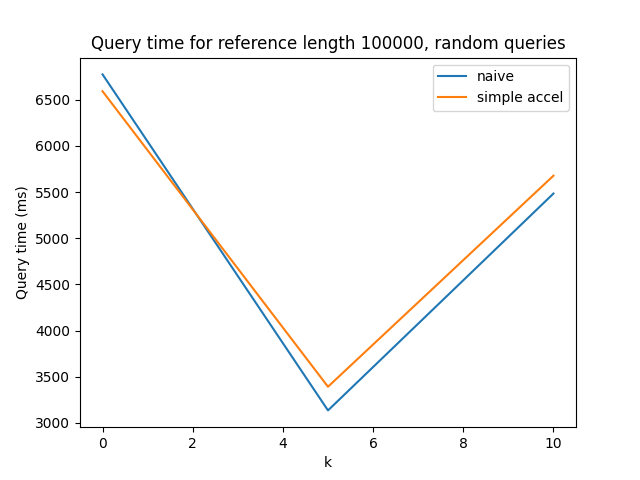

# CMSC 858D Spring 2022 HW 1

MG Hirsch

See instructions here: https://rob-p.github.io/CMSC858D_S22/assignments/02_suffix_arrays

Github repository: https://github.com/mghirsch42/CMSC858D-Sp22-HW2

## Part 1: Suffix Array Construction

### Scaling

#### Build Time

I built the suffix array over references wtih lengths 1,000, 10,000, and 100,000 and for no prefix table, and prefix tables with k = 5 and k = 10. References are random strings of A, C, G, and T. Results are from a single run.

The below plots show the build times for values of k = 0 (no prefix table), 5, and 10. If the naive algorithm was used in building the prefix table, the results are shown in blue, and if the simple acceleration algorithm was used and orange. For the smallest reference length, 1000, the increase in time between no prefix table and k = 5 was much larger than the increase between k = 5 and k = 10. However, for the larger references, lengths 10,000 and 100,000, the time increase from no prefix table to k = 5 was much lower than the increase from k = 5 to k = 10, with a more dramatic difference with the largest reerence length.

#### Index Size

Below are plots for each reference length showing how the index size scales with k for both the naive and simple acceleration (although which algorithm used shouldn't, and mostly doesn't, affect index size I included it for completeness despite the fact that the lines almost completely overlap).

For the smallest reference length, the index size appears to increase linearly with respect to k. However, the larger index sizes look much more exponential. In addition, as the reference size scales by a factor of ten, the index size also scales approximately by a factor of ten. This makes sense because the index is storing the reference.

#### Max genome size with 32 GB of RAM?

Assuming we don't use a prefix table, the size of the index goes from 9 KB to 27 KB to 879 KB for each increase in the order of magnitude in the reference length (1000 to 10,000 to 100,000). If we generalize this to about an order of magnitude increase in the size of the index with each order or magnitude increase in the length of the reference, we could consider the sizes going from 10 KB to 100 KB to 1,000 KB (1 GB). So if we increase the reference length again to 1,000,000, we might expect the index to be 10 GB and with a reference length of 10,000,000, we might expect the index to be 100 GB. So with a 32 GB machine, we could expect to handle a reference with a million characters, maybe a couple of million, but not 10 million.

### Most challenging part

Setting up the prefix table was the hardest part for me. At first, I tried to mainly copy the query algorithm from the slides, but I found that some modifications were needed to get the lowest and highest index. I had to back away from the code and write out the different cases that could arise and would need different handling: when the query was equal, larger, or smaller to the current suffix, and for each of these if the query was one above the low index, one or two below the high index, or neither. I had to repeat this process two or three times after coded it when I was trying to fix bugs.

## Part 2: Suffix Array Querying

### Scaling

I created two types of queries: one that consisted of random strings of A, C, G, and T, and one that consisted of strings from the reference at random indices. (While this does not well represent biological data, I decided it would be appropriate for this assignment.) I set query lengths to be all 10 characters long or all 100 characters long. The number of queries in each set was either 100, 1000, or 10,000.

I queried on the indices from above built over references with lengths 1,000, 10,000, 100,000, and no prefix table, prefix tables with k = 5 and k = 10.

In the subsections below, I present results focusing on varying a single parameter. To calculate the values, I average across all other parameter types. For example, for the k value analysis, the value of the point for naive and k = 0 is the average across all runs with naive querying and k = 0 with varying querying lengths and number of queries. (Length of the reference and type of query (random or reference) are presented in different plots).

#### Prefix table k value

Across all reference lengths, for random queries, the query time decreases when introducing a prefix table with k = 5, and then the query time increases again when changing k from 5 to 10. However, the increase between k = 5 and k = 10 decreases as the reference length increases.

In contrast, for reference queries, not only does the query time decrease with the introduction of the prefix table, but it also decreases with the increase of k. The decrease in query time between k = 5 and k = 10 increases with the increase of reference length.

There doesn't seem to be much difference between the naive and simple accelleration methods.

Random queries: 

Reference queries: 

#### Query length

The results for varying the query lengths does surprise me somewhat. I only have two query lengths I considered, 10 characters and 100 characters. Looking at the random queries, with the larger query length, the query time decreased for all reference lengths and both for the naive and simple acceleration algorithms. However, the relationship between the naive and simple acceleration algorithms and the variance across reference lengths is inconsistent. For the shortest reference length, the naive method is slower than the simple acceleration method with the shorter queries, but is considerably faster with the longer queries. While the simple acceleration method was faster on the longer queries than it was on the shorter queries, it did not improve as much as the naive method. However, even the naive algorithm only improved by a few milliseconds. This makes sense since the reference is pretty short. For the medium size reference, again we see decreases for both methods with an increase in query length, but still less than 10 milliseconds or so. With this reference, the simple acceleration method is slower than the naive method by about 50 milliseconds for both query lengths. Then the query time for the longest reference shows the reverse trend of the shortest reference: the simple acceleration method is slower on the short queries but faster on the long queries and shows much more query time change than the naive method.

For the reference queries, again we get inconsistency. On the shortest reference, the naive algorithm is slower on the shorter queries but faster on the longer queries. On the medium reference, the simple acceleration algorithm is slower on the shorter queries but faster on the longer queries. And on the longest reference, the naive algorithm is strictly slower than the simple acceleration method by about 200 milliseconds on both query lengths. 

I'm not particularly sure what to make of this. My guess is that to some extent, with these small references and query lengths, the acceleration just doesn't matter much and the exact timing is a bit of a toss up, so without doing several runs and averaging, you get spurious differences.

Random queries: 

Reference queries: 

#### Number of queries

The time appears to increase fairly linear with respect to the number of queries for all reference lengths and for either random or reference queries (note that the plots have a log scale on only the x-axis). This could be expected, as that for even the queries taken from the reference it is unlikely that they would appear more than once, so cache probably wouldn't be utilized, and I did no other cross-query optimization.

There doesn't seem to be much difference between the naive and simple accelleration methods.

Random queries: 

Reference queries: 

### Memory/Speed Tradeoff

For references smaller than 100,000 characters, I don't think that the prefix table with k = 10 would be worth it. However, if the references are 100,000 characters or larger AND your queries come from your reference AND you can expect that the reference has some repetition, then the larger k value would appear to speed up the queries to the point where it would probably be worth the size if you would be doing a lot of queries.

### Most challenging part

I basically used the same code as when setting up the prefix table, and as mentioned above, I had some challenges with that. Aside from that, I think the hardest part of this was just trying different test reference texts and queries and debugging the different cases of results that could come out of the high and low index methods.

## Code

### Suffix array construction

I read in the FASTA file using code modified from https://rosettacode.org/wiki/FASTA_format#C.2B.2B. Then I clean the reference, turning it into all capital letters and replacing any characters that aren't A, C, G, or T into one of them uniformly at random. I used SDSL-Lite to construct the suffix array. The suffix array is stored in an integer vector.

### Prefix table construction

To build the prefix table, first, I get all k-mers from the reference string. I do not include k-mers that are not included in the reference, as those would need to search the entire suffix array so there is no reason to store their range. Then for each unique k-mer, I calculate the range of the suffix array by doing two slightly modified binary searches. These searches will return the indices of the suffix array that contain the lowest and highest matching suffixes up to k. I store this in a map where the keys are the k-mers and the values are tuples containing the low and high values of the suffix array range.

### Querying

To query the suffix array, I get an initial range from the prefix table by looking up the length k prefix of the query. Then I use the same methods as in the prefix table construction to find the high and low indices of matching suffixes, starting at the indices from the prefix table if any were found. If using simple acceleration, these methods will keep track of the longest common prefix during the binary search and only do character comparisons on characters after that prefix. If no matches are found, the method reports a count of 0. Otherwise, it reports the count as the high index - low index + 1. It also returns the values of the suffix array at those indices. These results are written to a text file.

### Saving and loading

I use the serialization library Cereal. Because I stored my prefix table as an unordered map from strings to tuples and Cereal does not support that (or at least I couldn't get it to work), I first turn the map into a string and then serialize the string. Then when reading, I read the serialized string into the string variable and use string methods to put the values into the map. I also serialize the reference and the prefix table k value. These did not need extra work to serialize. I do not save the length because I can calucate that from the reference after reading it in.

### Other

I also wrote a python script to generate references and queries of various lengths, bash scripts to build and query the suffix arrays with the various parameters, and python scripts to create plots.

## Resources

To construct the suffix array, I use SDSL-lite (https://github.com/simongog/sdsl-lite).

To read the FASTA file, I use code modified from https://rosettacode.org/wiki/FASTA_format#C.2B.2B. 

To serialize the data, I use Cereal (https://uscilab.github.io/cereal/index.html).